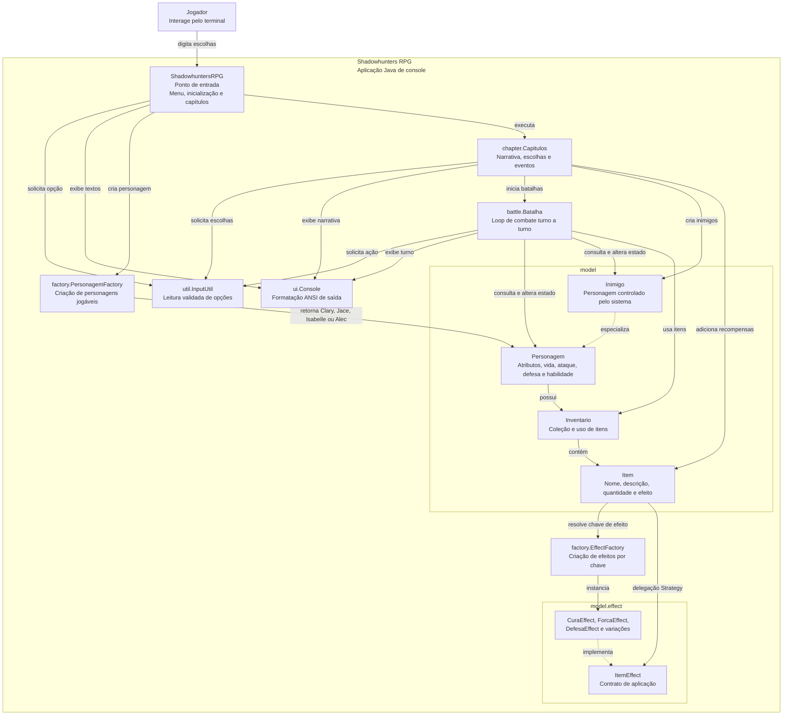

# Diagrama de Arquitetura C4 - Componentes

Este diagrama representa o nível de componentes do monolito modular. O sistema
roda como uma única aplicação Java de console, mas as responsabilidades internas
ficam separadas por pacotes.

## Leitura do Diagrama

- `ShadowhuntersRPG` não contém regras de batalha nem regras de item; ele apenas
  coordena o início do jogo e a sequência dos capítulos.
- `Capitulos` concentra a narrativa e cria batalhas quando uma escolha leva a um
  confronto.
- `Batalha` coordena turnos, ações do jogador, dano, habilidades e encerramento
  do combate.
- `Item` delega comportamento para `ItemEffect`, evitando `switch` de efeitos
  dentro da entidade.
- `InputUtil` padroniza a leitura numérica em todos os fluxos.

## ADRs Relacionadas

- `ADR-001`: monolito modular;
- `ADR-002`: Strategy para efeitos de item;
- `ADR-003`: Factory Method para criação;
- `ADR-005`: centralização da entrada em `InputUtil`.
