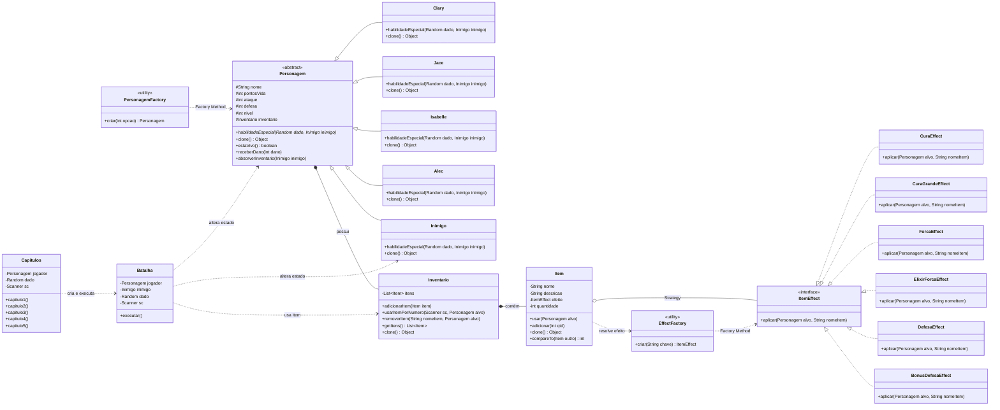

# Diagrama de Classes - Padrões GoF

Este diagrama destaca as classes de domínio e os pontos em que os padrões GoF
foram aplicados na refatoração.

## Padrões Representados

| Padrão | Classes | Intenção |
|---|---|---|
| Strategy | `ItemEffect` e implementações | Separar cada efeito de item em uma estratégia independente. |
| Factory Method | `PersonagemFactory`, `EffectFactory` | Centralizar a criação de personagens e efeitos. |
| Prototype | `clone()` e construtores de cópia em `Personagem`, `Inventario` e `Item` | Garantir cópias profundas dos objetos mutáveis. |
| Template Method / Polimorfismo | `Personagem.habilidadeEspecial` nas subclasses | Padronizar o contrato da habilidade especial e deixar cada personagem implementar sua variação. |

## Observações

- `ItemEffect` é compartilhável porque os efeitos atuais não guardam estado.
- `Inventario.getItens()` retorna cópia defensiva da lista, preservando a lista
  interna do inventário.
- `Batalha` e `Capitulos` aparecem no diagrama para mostrar como o domínio é
  usado no fluxo principal do jogo.
