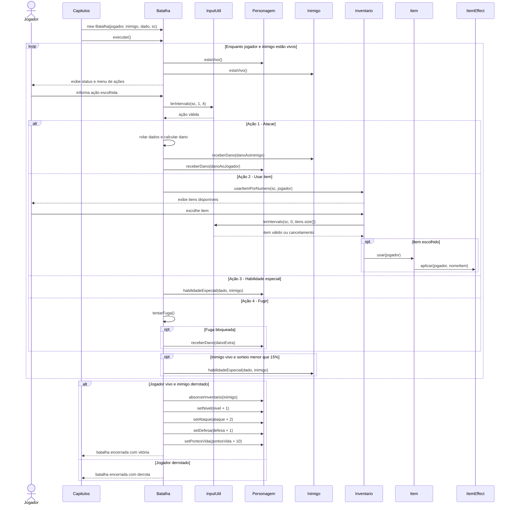

# Diagrama de Sequência - Fluxo de Batalha

Este diagrama descreve o fluxo principal de uma batalha iniciada por um capítulo.
Ele foca nas interações entre narrativa, combate, personagem, inimigo, inventário
e estratégias de item.

## Regras Documentadas

- A leitura da ação do jogador passa por `InputUtil.lerIntervalo`.
- O ataque comum calcula dano com atributo de ataque, defesa do alvo e rolagem de
  dado.
- O uso de item passa por `Inventario`, `Item` e a estratégia `ItemEffect`.
- A habilidade especial é polimórfica: cada personagem implementa sua própria
  regra.
- Ao vencer, o jogador absorve itens do inimigo e recebe incremento de nível,
  ataque, defesa e pontos de vida.
